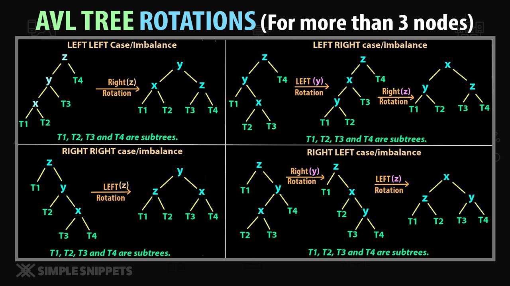

# AVL Tree
| Operation | Worst Time | Average Time | Best Time |
| ---   |   ---     | --- | --- |
| Insertion | $O(\log_2n)$ | $O(\log_2n)$ | $O(\log_2n)$ |
| Deletion | $O(\log_2n)$ | $O(\log_2n)$ | $O(\log_2n)$ |
| Find | $O(\log_2n)$ | $O(\log_2n)$ | $O(\log_2n)$ |

- Always balanced.
- The height is always $< 1.44\log_2(n+1) \sim \log_2n$

### Types of Rotations

- LL 
- LR
- RL
- RR
