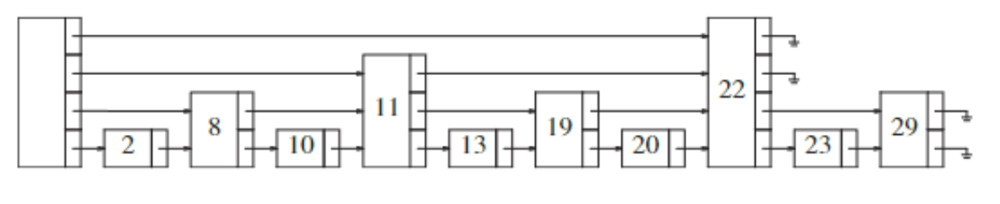

## What is a hash function?
From a domain of infinite values, generates a value inside a finite codomain.


## Hashing for Insertion
```cpp
index = hash(input) % arraySize;
```

## Collision Avoidance
### 1) RNG
Using a set seed (so the same input gets same output).
Injects a bit of randomness so 2 different numbers probably won't calculate to the same hash.

### 2) Folding Method
> EX: SSN is 158-26-3906

Boundary Folding: $158 + 26 + 3906 = 3990$ <br>
Shift Folding: $158 + 62 + 3906 = 4026$

### 3) Extraction Method
Part of the key is used for computing the index. <br>
> EX. Use the last 4 numbers of ur SSN

### 4) Division Remainder Technique
Use mod to find the index. Efficacy decreases with smaller array size!